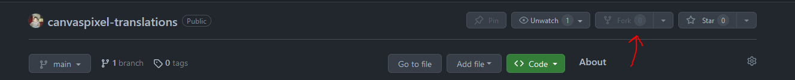
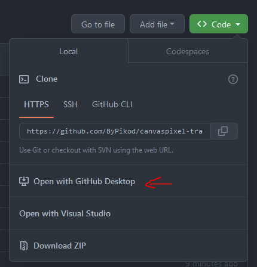
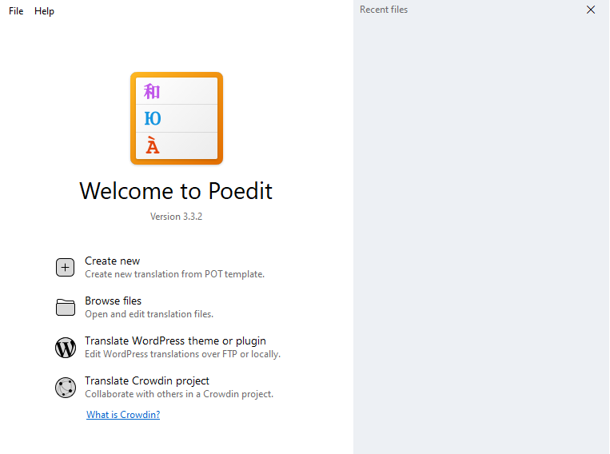
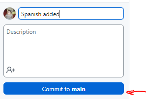
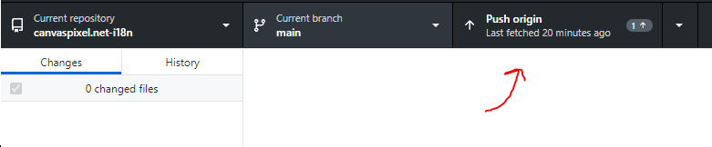
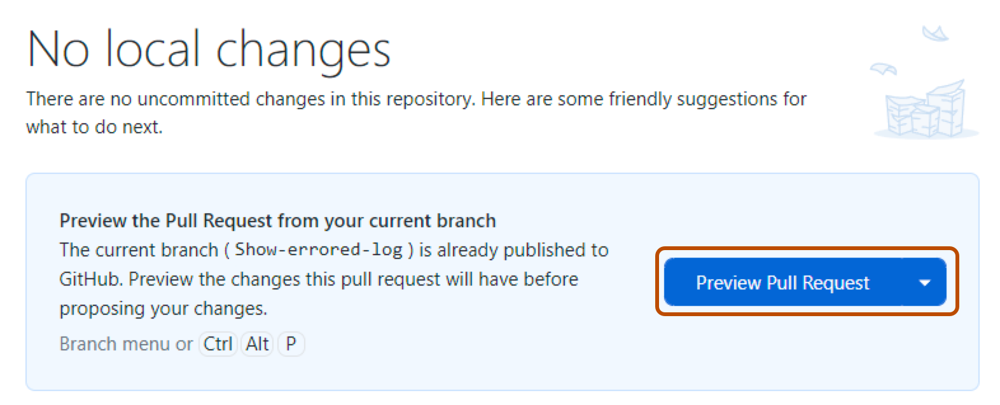

# Canvaspixel Translations

Here you can help us translate the game into your language. If you want to help us, please read the following instructions.

## How to contribute

1. Fork this repository. Forking means that you create a copy of this repository in your own GitHub account. You can do this by clicking the "Fork" button in the top right corner of this page.

    

2. Clone the repository
    - with **Git**: `git clone https://github.com/ByPikod/canvaspixel-translations.git`
        > [!NOTE]
        > Here you can download [Git](https://git-scm.com/downloads) if you don't have it.

    - **or** with **Github Desktop**: click the green "Code" button and then "Open with Github Desktop"

        

        > [!NOTE]
        > Here you can download [Github Desktop](https://desktop.github.com/) if you don't have it.

3. Download Poedit [here](https://poedit.net/) and install it.

    

4. Open Poedit and click "Create new translation" or open an existing translation.

    - You should choose template file (`.pot`) from the `po` folder of the repository when you create a new translation.

5. Translate the strings and save the file. The file name should be the language code of the language you are translating to. You can find the language code [here](https://www.loc.gov/standards/iso639-2/php/code_list.php). For example, if you are translating to Spanish, the file name should be `es.po`.

6. Commit your changes and push them to your forked repository.
    - with **Git**:
        1. `git add .`
        2. `git commit -m "Your commit message"`
        3. `git push`

    - **or** with **Github Desktop**: click the "Commit to main" button and then "Push origin"

        

        

7. Create a pull request. You can do this by clicking the "Pull request" button in the top right corner of your forked repository.

    

Your pull request will be reviewed and merged if there are no problems. Thank you for your contribution!

## Translators

Contributors who have helped us translate the game into their language.

